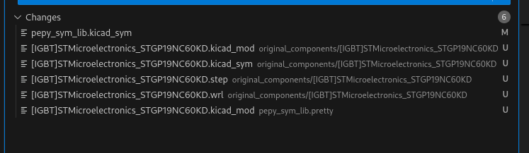

# pepy_symbol KiCAD component library
This is a KiCAD custom component library that comes in handy for my projects. Feel free to fork it or get inspired by it. It aims to automate the component addition, primarily by using an LCSC number, but components can also be added manually by following the structure.

*Note: Libary created used and optimized on KiCAD 8.0*


# How to start using the component library

## 0. Install easyeda2kicad (prereq: python)

```bash
pip install easyeda2kicad
```

## 1. Clone the Repository

Clone the repository to your local machine using the following command:

```bash
git clone git@github.com:dani9875/kicad_components.git
```

## 2. Add Symbol Libraries

1. Open **KiCad**.
2. Navigate to **Preferences** > **Manage Symbol Libraries**.
3. In the dialog:
   - Click the **Add Library** button (the `+` icon).
   - Locate and select the `pepy_sim_lib.kicad_sym` file from the cloned repository.
   - Choose **Global** or **Project** scope based on your preference.
4. Save the changes.

## 3. Add Footprint Libraries

1. Open **KiCad**.
2. Navigate to **Preferences** > **Manage Footprint Libraries**.
3. In the dialog:
   - Click the **Add Library** button (the `+` icon).
   - Locate and select the `pepy_sim_lib.pretty` folder from the cloned repository.
   - Choose **Global** or **Project** scope based on your preference.
4. Save the changes.

## 4. Configure Paths

1. Open **KiCad**.
2. Navigate to **Preferences** > **Configure Paths**.
3. In the dialog:
   - Click the **Add Path** button (the `+` icon).
   - Add an environment name called **`ORIGINAL_COMPONENTS`**.
   - Associate it with the `original_components` folder from the cloned repository.
4. Save the changes.

# How to add new components to the library

## New individual components 
1. Search for a component on **LCSC**, for example:  
   [https://www.lcsc.com/product-detail/igbt-transistors-modules_stmicroelectronics-stgp19nc60kd_C59521.html](https://www.lcsc.com/product-detail/igbt-transistors-modules_stmicroelectronics-stgp19nc60kd_C59521.html).

2. Retrieve the **LCSC part number**, e.g., `C59521`.

3. Assign a descriptive name to the component, using underscores (`_`) instead of spaces. For example:  
   `[IGBT]STMicroelectronics_STGP19NC60KD`  
   - The prefix `[IGBT]` is based on the type of component (determine the type yourself).  
   - The rest of the name should include the manufacturer and part number.

4. Run the following command to add the component:

   ```bash
   ./add_component.sh C59521 [IGBT]STMicroelectronics_STGP19NC60KD
    ```

5. The script will automatically generate files, with the following results:
- The original files will be retained in the `original_components` folder under a subfolder named after the name you provided (this includes the symbol, 3D files, and design file).  
- The `pepy_sym_lib.kicad_sym` file will be updated with the new symbol file descriptor.  
- The design file will be stored in the `pepy_sym_lib.pretty` folder under the component's design.



## New general components (e.g. resistors, capacitors) 

1. Search for a component on **LCSC**, for example:  
   [https://www.lcsc.com/product-detail/Chip-Resistor-Surface-Mount_UNI-ROYAL-Uniroyal-Elec-0805W8F4701T5E_C17673.html](https://www.lcsc.com/product-detail/Chip-Resistor-Surface-Mount_UNI-ROYAL-Uniroyal-Elec-0805W8F4701T5E_C17673.html).

2. Look up the folder where you would like to place the component, e.g., [RES_SMD_0805_2012Metric]. If the folder does not exist, you need to download the component and manually create a general folder similar to the example folder above.

3. Retrieve the **LCSC part number**, e.g., `C17673`.

   ```bash
   ./add_component.sh C17673 [RES_SMD_0805_2012Metric]4.7k_UNI-ROYAL(Uniroyal Elec)0805W8F4701T5E --generic [RES_SMD_0805_2012Metric]
   ```

4. Make some changes by hand
   - Go to the symbol editor and select the component in question.
   - Unify the symbol appearance with others, including the settings for data visibility.
   - Set the correct footprint library.
   - Remove the value from the symbol name.
   - Add any other useful data to the fields.
   - Save it.

## Manually handled components
Currently the test point and mounting holes are handled manually. They generally have same symbols however their footprint tend to vary. 


## Release notes

### Version: v4
Changelog:
- 10P 2x5 1.27 mm pin header added to library

### Version: v3
Changelog:
- 10 nF YAGEO capacitor added
- 100 MOhm Visay resistor added
- Resistor with 1206 size (symbol and footprint) added

### Version: v2
Changelog:
- Param generic resistor/capacitor compnent
- FUSE added (generic)
- Adding information to many components

### Version: v1
Changelog:
- Initial component library


## List of potentional improvements
- [ ] Don't run update on original_components folder when running "add_component.sh"
- [ ] Consumpotion and other parameters for the components
- [ ] Bespoke inventory and generated BOM footprint interface adapation

